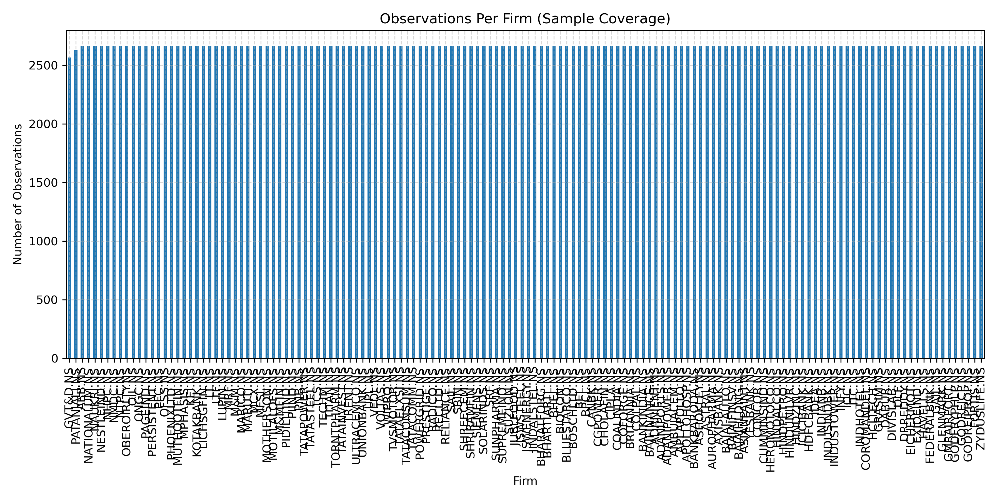
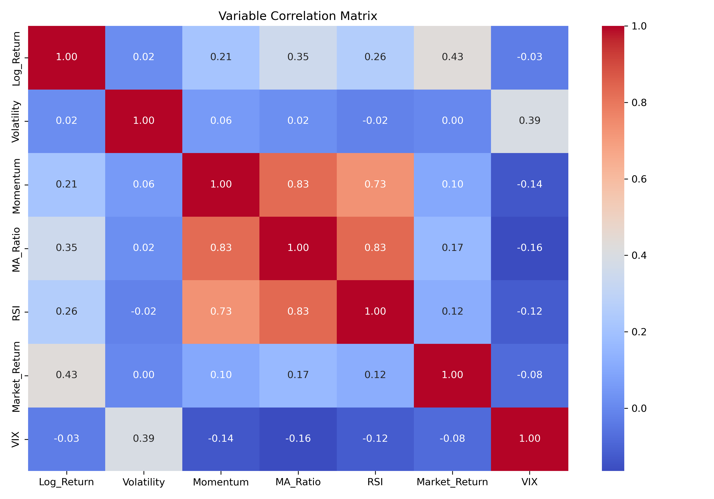
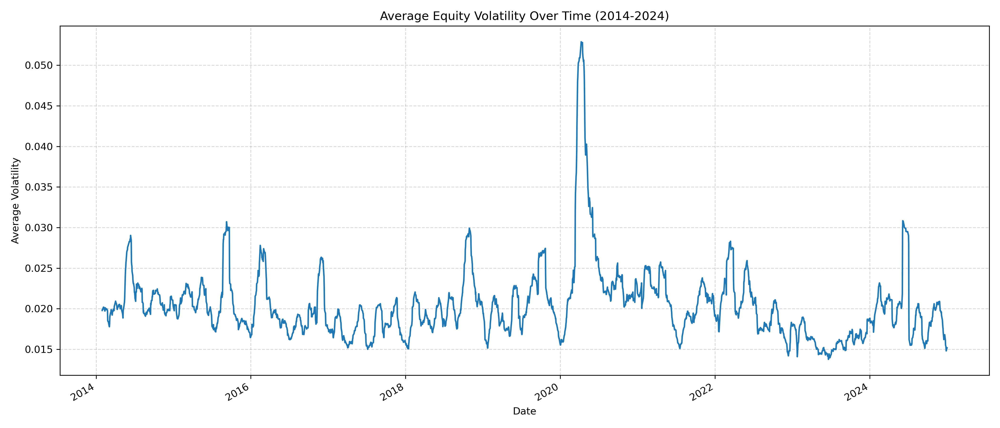
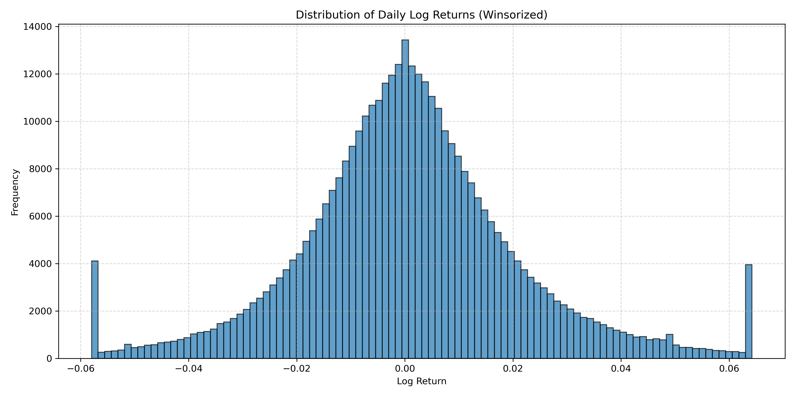
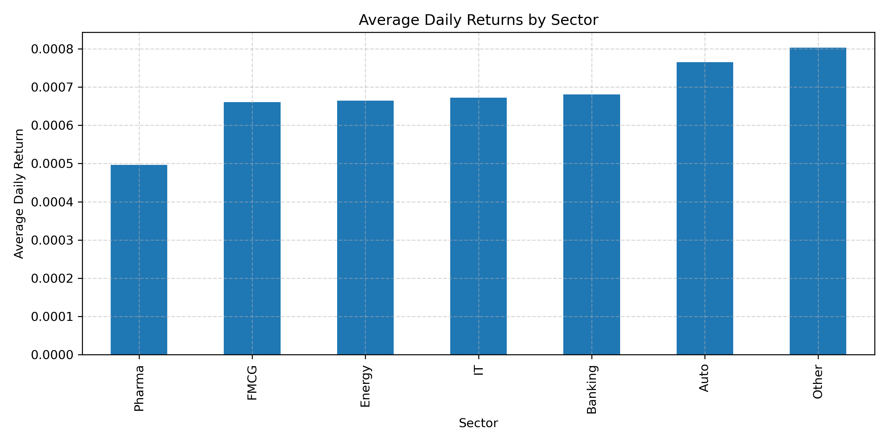
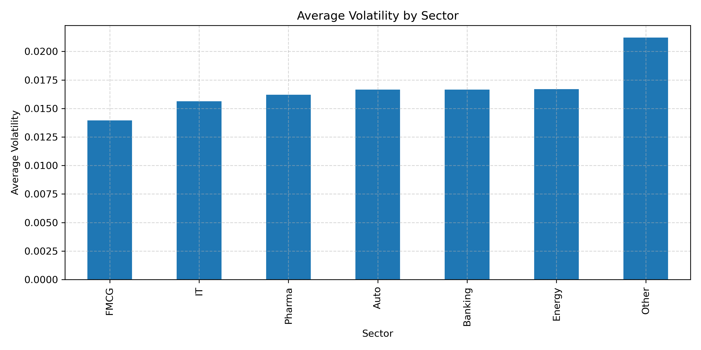

# Historical Panel Econometric Analysis of Nifty Equities (2014–2024)

This repository contains the dataset and codebase for an empirical study of equity returns, historical volatility, and technical indicators for constituents of the Nifty 100 and Nifty 200 indices over a ten-year historical window (2014–2024). Using panel data econometrics, the project estimates Pooled OLS, Entity Fixed Effects, Random Effects, and First Difference regression architectures to evaluate the predictive power of rolling volatility, price momentum, moving average ratios, and the Relative Strength Index (RSI), while controlling for systemic risk proxies (India VIX) and market returns (Nifty 50 Index).

## Repository Structure

```
├── nifty_econometrics.ipynb   # Interactive Jupyter Notebook detailing the research workflow
├── analysis.py                # Executable Python script compiling the data pipeline and regressions
├── nifty100.tex               # LaTeX source for the typeset academic research paper
├── plots/                     # High-resolution econometric charts and visualizations
│   ├── sample_coverage.png         # Firm-wise observation density (data completeness density)
│   ├── correlation_matrix.png      # Feature and control variable correlation heatmap
│   ├── returns_distribution.png    # Probability distribution of daily log returns
│   ├── average_volatility.png      # Market-wide rolling historical volatility time series
│   ├── average_returns.png         # Daily mean log returns across all panel constituents
│   ├── sector_returns.png          # Average daily log returns by major industrial sector
│   └── sector_volatility.png       # Average rolling volatility by major industrial sector
└── README.md                  # Project documentation and econometric overview
```

## Theoretical Econometric Framework

To model the relationship between firm-level daily log returns ($y_{it}$) and engineered financial indicators ($X_{it}$), we implement four distinct panel data regression specifications. Panel data methods are essential here because they allow us to observe multiple firms ($i = 1, \dots, N$) over multiple time periods ($t = 1, \dots, T$).

### 1. Pooled Ordinary Least Squares (OLS)
The baseline Pooled OLS model assumes that the intercept and slope coefficients are constant across all firms and time periods:
$$y_{it} = \beta_0 + X_{it}\beta + z_t\gamma + u_{it}$$
where $X_{it}$ is a vector of firm-level predictors, $z_t$ represents time-varying macro controls (India VIX and Nifty 50 returns), and $u_{it}$ is the idiosyncratic error term. Pooled OLS assumes no firm-specific unobserved heterogeneity, serving as a restrictive baseline.

### 2. Entity Fixed Effects (FE) Model
To address the omitted variable bias arising from unobserved, time-invariant firm-specific characteristics (e.g., sector classification, corporate governance quality, brand strength), we estimate an Entity Fixed Effects model:
$$y_{it} = \alpha_i + X_{it}\beta + z_t\gamma + u_{it}$$
where $\alpha_i$ represents the time-invariant firm-specific intercept (entity effect). By subtracting the entity-specific mean over time (the "within" transformation), we eliminate $\alpha_i$, enabling unbiased estimation of $\beta$ even if $\alpha_i$ is correlated with the regressors.

### 3. Random Effects (RE) Model
The Random Effects model is appropriate if the unobserved firm-specific heterogeneity $\alpha_i$ is assumed to be a random variable uncorrelated with the explanatory variables:
$$y_{it} = \beta_0 + X_{it}\beta + z_t\gamma + (\alpha_i + u_{it})$$
where $\alpha_i \sim i.i.d.(0, \sigma^2_\alpha)$ and $u_{it} \sim i.i.d.(0, \sigma^2_u)$. RE is estimated via Generalized Least Squares (GLS) and is more efficient than FE, but it yields inconsistent estimates if the orthogonality assumption $E[\alpha_i | X_{it}] = 0$ is violated. The Hausman specification test is utilized to formally evaluate the appropriateness of FE versus RE.

### 4. First Difference (FD) Model
To address potential non-stationarity, unit roots, or highly persistent serial correlation in the time series components, we estimate the model in first differences:
$$\Delta y_{it} = \Delta X_{it}\beta + \Delta z_t\gamma + \Delta u_{it}$$
where $\Delta y_{it} = y_{it} - y_{i,t-1}$. This transformation eliminates the time-invariant entity effects $\alpha_i$ and helps ensure covariance stationarity, particularly for features with near-unit-root characteristics.

## Data Methodology & Specification Filters

### Balanced Panel and Selection Bias Mitigation
To avoid survivorship and selection biases, we download historical price series for all listed Nifty 200 constituents. We apply a strict data-density filter, retaining only firms with at least 85% of total trading days populated over the 2014–2024 horizon. This yields a highly robust balanced panel of 165 core firms, ensuring that the econometric estimators are stable and not driven by transient listings.

### Custom Feature Engineering
All independent variables are mathematically engineered from the raw daily close, high, low, and volume series:
* **Log Returns**: Calculated as $\log(Close_{it} / Close_{i,t-1})$ to ensure time-additivity and symmetry.
* **Rolling Volatility**: Formulated as the 21-day rolling standard deviation of daily log returns, representing historical short-term equity risk.
* **Momentum**: Calculated as the 21-day percentage change in price, capturing short-to-medium-term trend characteristics.
* **Moving Average Ratio (MA Ratio)**: The ratio of the closing price to its 21-day moving average ($Close_{it} / MA_{it}(21)$) to identify local mean-reverting deviations.
* **Relative Strength Index (RSI)**: A custom 14-day RSI built from scratch using pandas rolling average gains and losses.
* **Systemic Macro Controls**: Daily Nifty 50 returns control for systemic market shocks, and the daily India VIX index controls for macroeconomic volatility and market fear.

### Outlier Treatment (Winsorization)
Empirical asset pricing regressions are highly sensitive to price shocks, corporate actions, and trading anomalies. To prevent extreme observations from distorting the parameter estimates, we perform 1% and 99% two-tailed Winsorization on the daily returns, momentum, and rolling volatility series, capping outliers at these respective percentiles.

## Visualizations Gallery

### 1. Data Completeness & Observation Density
This chart displays the number of active daily observations across the selected firms, confirming the high density and balanced nature of the panel.


### 2. Variable Correlation Heatmap
Explores linear relationships among the engineered features and control variables, highlighting potential multicollinearity concerns (e.g., between RSI and Momentum).


### 3. Market Volatility & Returns Over Time
These charts trace the historical trajectory of rolling equity volatility alongside the overall probability distribution of winsorized log returns.
| Average Equity Volatility Over Time | Daily Returns Distribution |
|---|---|
|  |  |

### 4. Sector Risk-Return Profiles
Contrasts defensive sectors against cyclical or high-beta sectors in terms of average daily log return and rolling volatility.
| Returns by Sector | Volatility by Sector |
|---|---|
|  |  |

## Pipeline Execution

### Prerequisites
The computational pipeline is written in standard Python 3. The econometric estimation relies on `statsmodels` and the `linearmodels` package (for robust panel regressions). Install dependencies via:

```bash
pip install pandas numpy yfinance seaborn matplotlib statsmodels linearmodels
```

### 1. Standalone Script Execution
To execute the data acquisition, cleaning, feature engineering, plot creation, and panel regressions from a terminal:
```bash
python analysis.py
```

### 2. Interactive Analysis
To explore the step-by-step econometric pipeline in a Jupyter environment:
```bash
jupyter notebook nifty_econometrics.ipynb
```

### 3. LaTeX Compilation
To compile the academic research report from the LaTeX source:
```bash
pdflatex nifty100.tex
```

## License
Distributed under the MIT License.
