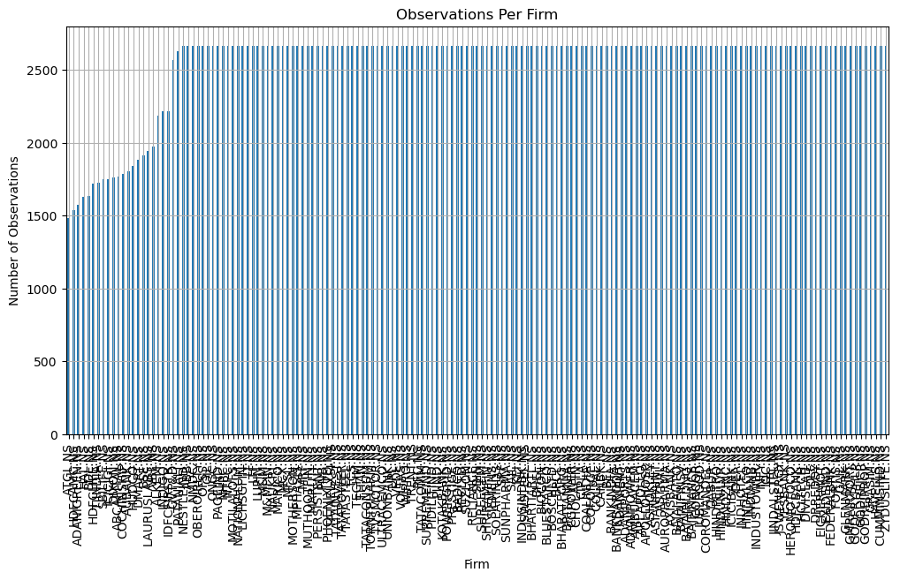
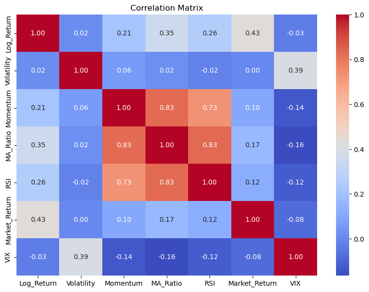
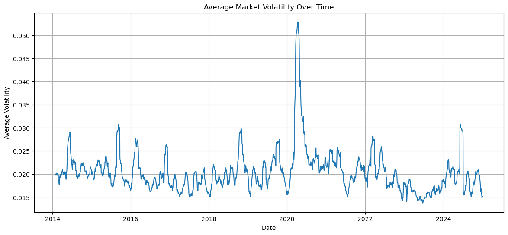
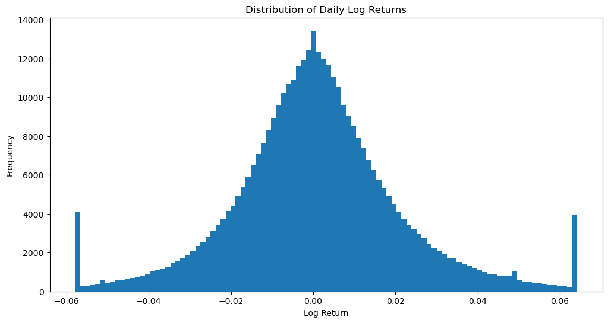
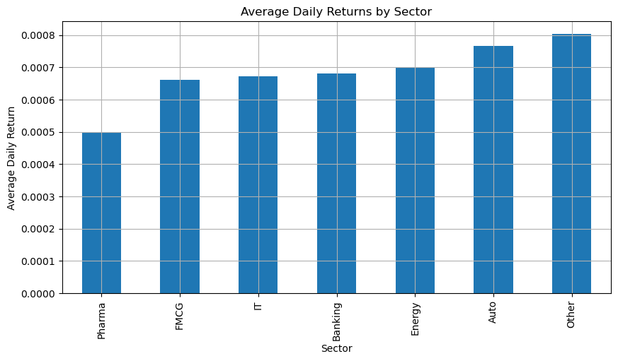
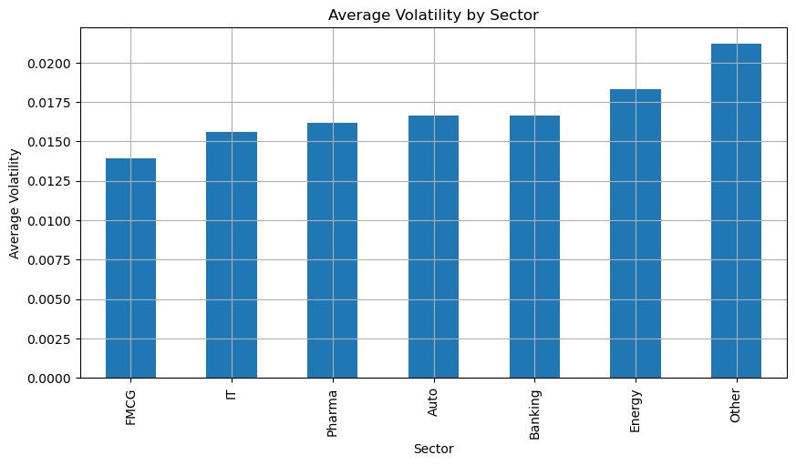

# 📊 Nifty Quantitative Portfolio & Panel Econometric Analysis (2014 – 2024)

[](https://www.python.org/)
[](https://jupyter.org/)
[](https://www.latex-project.org/)
[](https://opensource.org/licenses/MIT)

An advanced quantitative research project performing a **historical panel data econometric analysis** of the top Indian firms listed on the **Nifty 100/200 indices** over a 10-year horizon (2014 – 2024). 

This repository showcases a complete end-to-end quantitative research workflow: from historical data ingestion and robust feature engineering, through statistical outlier treatment (Winsorization) and data-completeness filters, to advanced **Panel Data Regression Modeling** (Fixed Effects, Random Effects, Pooled OLS, and First Difference) and a fully typeset academic PDF report.

---

## 📁 Repository Structure

```
├── nifty_econometrics.ipynb   # 🚀 Interactive, fully runnable Jupyter Notebook
├── analysis.py                # 💻 Clean, standalone Python script version
├── nifty100.tex               # ✍️ Academic LaTeX paper outlining findings
├── plots/                     # 📊 High-resolution econometric charts & visualizations
│   ├── output_34_0.png        # Observations per firm (data completeness density)
│   ├── output_42_0.png        # Asset correlation matrix heatmap
│   ├── output_43_0.png        # Daily log returns probability distribution
│   ├── output_44_0.png        # Average market volatility over time (2014-2024)
│   ├── output_45_0.png        # Average daily returns across firms
│   ├── output_50_0.png        # Average daily returns by sector
│   └── output_51_0.png        # Average volatility by sector
└── README.md                  # Comprehensive portfolio documentation
```

---

## 💡 What You Can Showcase in Your Portfolio

This project is designed to show deep expertise in **quantitative finance, financial engineering, and econometric modeling**. Here are the main talking points you can highlight to interviewers:

### 1. Rigorous Data Cleaning & Panel Completeness Filters
* **Data Selection Bias Mitigation:** To avoid survivorship and selection bias, companies with less than 85% data density over the 10-year trading history were filtered out, leaving a robust balanced panel of **165 core firms** representing the backbone of the Indian stock market.
* **Statistical Outlier Treatment (Winsorization):** Standard OLS regressions are highly sensitive to extreme events (such as price shocks during market crises). The pipeline applies 1% and 99% percentile **Winsorization** to clip extreme tails in log returns, volatility, and momentum, ensuring stable and unbiased econometric estimators.

### 2. Custom Feature Engineering
Instead of relying on basic indicators, the features are engineered from raw pricing data:
* **Log Returns ($\log(Close_{t} / Close_{t-1})$):** Mathematically superior to simple returns due to time-additivity and symmetry.
* **Rolling Volatility:** 21-day rolling standard deviation of daily log returns.
* **Momentum:** 21-day rolling returns to capture intermediate price trends.
* **Moving Average Ratio (MA Ratio):** Ratio of closing price to its 21-day moving average, identifying short-term overbought/oversold levels.
* **Relative Strength Index (RSI):** A custom 14-day RSI built from scratch using pandas rolling windows.
* **Exogenous Macro Controls:** Integrates market returns (Nifty 50 Index) and systemic volatility (India VIX) to capture macroeconomic shifts.

### 3. Advanced Econometric Panel Regressions
Showcases your ability to model cross-sectional time-series data using four distinct econometric architectures:
* **Pooled OLS:** Establishing the baseline relationship.
* **Fixed Effects (FE / Entity Effects):** Controls for **unobserved individual heterogeneity** (e.g. firm-specific factors like management quality, brand value, or regulatory environment) which are time-invariant but otherwise correlate with our predictors.
* **Random Effects (RE):** Modeled under the assumption that entity-specific differences are random and uncorrelated with regressors.
* **First Difference (FD):** First-differenced regression designed to address non-stationarity and serial correlation in long time-series panels.

---

## 📊 Visualizations Gallery

### 1. Data Completeness & Observations
Tracks the density of data points across the sample of Indian equities from 2014 to 2024, ensuring statistical significance.


### 2. Feature Correlation Heatmap
Explores linear relationships among returns, volatility, VIX, RSI, momentum, and the moving average ratio.


### 3. Market Volatility & Returns Over Time
Highlights regime shifts, macro shocks (such as the 2020 crash), and market corrections.
| Market Volatility Over Time | Daily Returns Distribution |
|---|---|
|  |  |

### 4. Sector Risk-Return Profiles
Contrasts defensive sectors (like FMCG and Pharma) against high-beta cyclical sectors (such as Auto, Banking, and Energy).
| Returns by Sector | Volatility by Sector |
|---|---|
|  |  |

---

## 🚀 How to Run the Analysis

### 1. Install Dependencies
You can run the entire pipeline with a standard Python environment:

```bash
pip install pandas numpy yfinance nsepython seaborn matplotlib statsmodels linearmodels
```

### 2. Run the Jupyter Notebook
For the most interactive experience, open and run the notebook:
```bash
jupyter notebook nifty_econometrics.ipynb
```

### 3. Run the Standalone Script
To execute the pipeline directly from a terminal:
```bash
python analysis.py
```

### 4. Compile the Academic Report
To compile the academic LaTeX report into a PDF:
```bash
pdflatex nifty100.tex
```

---

## ✍️ Authors & License
Developed as a quantitative research project. Distributed under the [MIT License](LICENSE).
